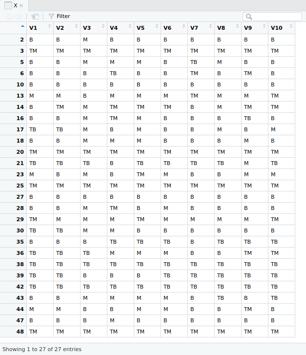
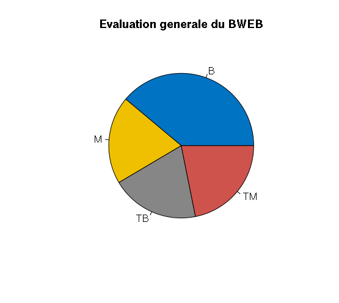
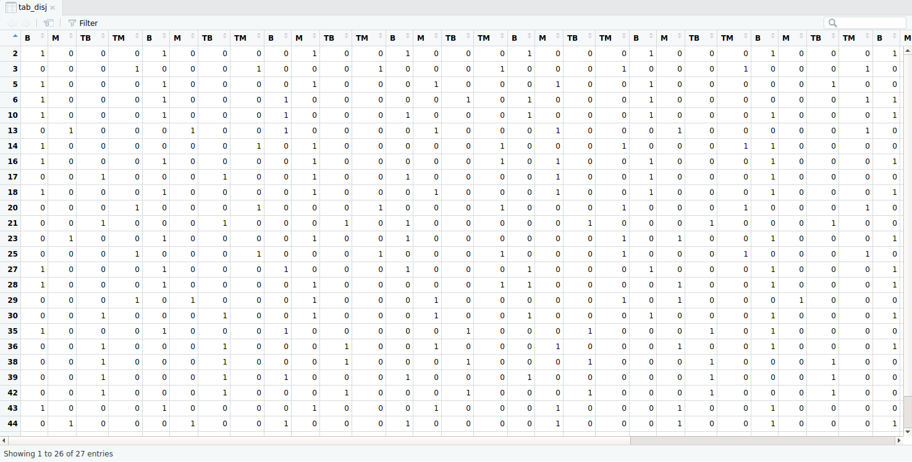
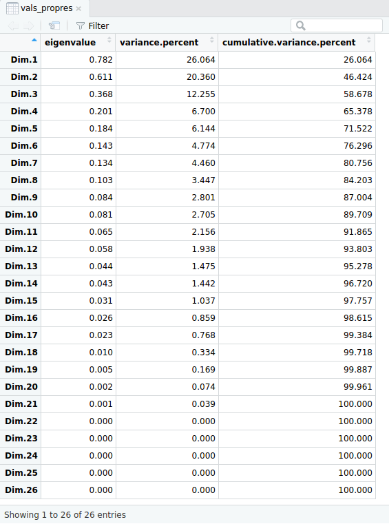
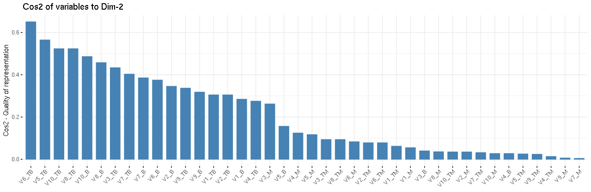
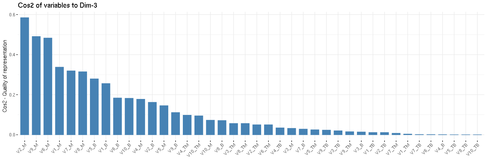
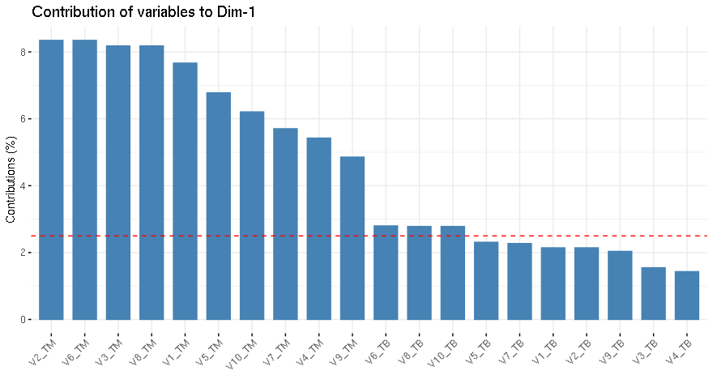
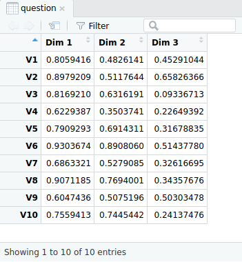
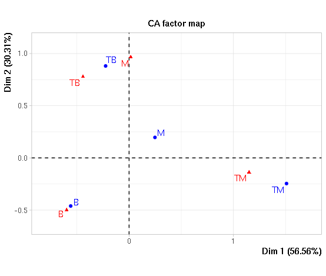
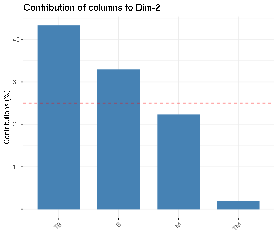

<div style="text-align:center;font-size:30px">﷽</div>


<div>
<div style="text-align:center;font-size:48px">Multiple Correspondence Analysis</div>
<div style="text-align:center;font-size:35px">Analyzing a survey like a boss using ACM with R <br/>(In french)
</div>
</div>


Fait par **Mehdi CHEBBAH**

---


# Tableau de Contenu

[TOC]

---

## Environnement de l’étude

### Technique:

+   Langage utilisé: **R**,

+   IDE utilisé: **R Studio**,

+   `Packages` utilisé: 

    +   **FactoMineR** 
    +    **factoextra**
    +   **ggplot2**

    Pour les installer dans `R`:

    ```R
    install.packages(c("FactoMineR", "factoextra", "ggplot2"))
    ```

### Fonctionnel

Dans ce qui suive on va utiliser les abréviations suivantes:

*   **Pour les variables**:
    *   **V1** : Les objectifs et le programme de l'UE étaient clairs,
    *   **V2** : Le programme réalisé correspond au programme annoncé,
    *   **V3** : Je maîtrisais les antécédents et pré-requis nécessaires,
    *   **V4** : La matière est bien exposée et capte mon attention,
    *   **V5** : Je suis bien encadré dans la résolution des exercices,
    *   **V6** : Les TD/TP/Projet étaient utiles pour une bonne assimilation du cours,
    *   **V7** : Les supports pédagogiques (transparents, polycopié, séries, ...) étaient disponibles et utiles pour l'apprentissage,
    *   **V8** : Le volume horaire prévu dans l'UE a été respecté,
    *   **V9** : Le contenu des contrôles et évaluations correspondait aux aspects traités en Cours/TD/TP,
    *   **V10** : La quantité de travail demandée est adaptée à l'UE.
*   **Pour les modalités**:
    *   **TB** (très bien): ++ ,
    *   **B** (bien): + ,
    *   **M** (mauvais): - ,
    *   **TM** (très mauvais): -- .

<div class="page-break"></div>
## I. Objectif de cette étude

Cette étude a pour rôle de :

+   Comprendre les avis des étudiants vis-a-vis le module BWEB.
+   Comprendre les relations entre les questions posées dans le formulaire.
+   Comprendre les relations entre les étudiants en ce qui concerne le module BWEB.

## II. La collection des données

Je vais utilise les données envoyées `Evaluation 1CPI 2018-2019 S1.xls --> BWEB`

Donc cette phase (**Data collection**) n'est pas nécessaire dans ma situation mais dans une analyse de données ou les données ne sont pas disponibles c'est une phase très importante, elles permet de collecter les ressources nécessaire pour l’étude.

Pour faire l’étude en `R` on va exporter la feuille `BWEB` dans le fichier  `Evaluation 1CPI 2018-2019 S1.xls` en forma `.CSV` 

`File --> Save As --> Other Formats` et vous choisissez `CSV`.

Dans ce qui suive on va référencer ce fichier par `BWEB.CSV.`

## III. Pre-traitement des données

Cette phase (**Data pre-prcessing**) est la phase la plus lente (environ 60% du temps de data analyste) et la phase qui détermine la qualité de l’étude. Elle est résumé dans le `secript R` suivant:

```R
# Importation des packages necessaires
library(FactoMineR)
library(ggplot2)
library(factoextra)

# lecture du fichier BWEB.CSV
# X c'est le tableau de données
X = read.csv(file.choose(),header = TRUE) # Choisir le fichier `DATA.CSV`

# Changer le nom des variables (les colonnes)
colnames(X)=c("Individue", "V1","V2","V3","V4","V5","V6","V7","V8","V9","V10")
# éliminer la première colonne
X=X[-1]
# Éliminer les 6 derniers lignes inutiles
X=X[-c(50:55),]
# Éliminer les lignes vides
X = X[!apply(X == "", 1, all),]

# Remplacer les notations actuels avec notre notation
X[, ] <- lapply(X[, ], as.character)
for(j in 1:ncol(X)){
  X[j][X[j] == "++"] <- "TB"
  X[j][X[j] == "+"] <- "B"
  X[j][X[j] == "-"] <- "M"
  X[j][X[j] == "- -"] <- "TM"
}

# Ajouter les modalites aux `levels(X)`
levels(X)[c(1,2,3,4)]=c("TB", "B", "M", "TM")
for(i in 1:ncol(X)){
  levels(X[i])[c(1,2,3,4)] = c("TB", "B", "M", "TM")
}

```

Après l’exécution de ce script le tableau de données sera comme dans le figure si-après:




<div class="page-break"></div>
## IV. Analyse statistique simple sur les données

### A. Étude générale:

On veut dans un premier temps de savoir en générale l’idée des étudiants sur ce module pour faire on va visualiser les totales des réponses sans voire les questions.

1.  Création du tableau contenant le totale de chaque modalité pour chaque question

    ```R
    y = data.frame(B = c(1:10),
                   M = c(1:10),
                   TB = c(1:10),
                   TM= c(1:10))
    
    for(i in 1:ncol(X)){
      y[i,] = table(X[i])
    }
    View(y)
    ```

    

    **le résultat:**


2.  Visualisation des totales des modalités

    ```R
    pie(c(B=sum(y[1]), M=sum(y[2]), TB=sum(y[3]), TM=sum(y[4])),
        main = "Evaluation generale du BWEB",
        col = c("#0073C2FF", "#EFC000FF", "#868686FF", "#CD534CFF"))
    ```

    **Le résultat:**

    

    **L’interprétation:**

    On remarque qu'un tiers des réponses étaient **BIEN** et les autre réponses sont pratiquement égales, ce qui veut dire que plus de 50% des réponses sont positives ==> Généralement le module *BWEB*  est évalué **BIEN**.

### B. Étude détaillés des questions :

On veut visualiser les réponses de chaque question pour cela on reprend le tableau `y` dans la section prétendantes.

```R
y1 = data.frame(Q = c(1:40),
                R = c(1:40),
                N = c(1:40))
for (i in 1:40) {
  y1[i,1] = ((i-1) %/% 4)+1
}
levels(y1) = c("B", "M", "TB", "TM")
for (i in 1:40) {
  y1[i,2] = switch(((i-1) %% 4)+1, "B", "M", "TB", "TM")
}
for(i in 1:nrow(y)){
  for (j in 1:ncol(y)) {
    y1[((i-1)*4)+j,3] = y[i,j] 
  }
}

# Grouped
Repenses = y1$R
Nombre_de_personnes = y1$N
Question = y1$Q
ggplot(y1, aes(fill=Reponses, y=Nombre_de_personnes, x=Question)) + 
  geom_bar(position="dodge", stat="identity")
```


On remarque de ce schéma:

+   La majorité des repenses sur les questions était *BIEN.*
+   Beaucoup des étudiants ont répondues par *TRES MAUVAIS* aux questions 9 et 10 (27%).
+   La majorités des étudiants ont rependues sur la troisième questions par *MAUVAIS*.
+   

##### Le tableau disjonctif

```R
tab_disj = tab.disjonctif.prop(X)
```

Le resultat



<div class="page-break"></div>
## V. Analyse approfondie des données

### Analyse Factorielle des Correspondances Multiples:

Le raison pour lequel on va faire une *Analyse Factorielle des Correspondances Multiples* est que les données sont qualitatives et qu'on a plus de deux variables. La commande pour faire un `AFCM` est:

```R
afcm = MCA(X)
```

##### 1. Les valeurs propres/pourcentage d'inertie:

```R
vals_propres = round(get_eigenvalue(afcm),3)
```

cette instruction va générer un tableau contenant les valeurs propres et les inertie associés et les inerties cumulés



Si on voulez retenir 80% de l'information il faut retenir 7 axes qui est très beaucoup dans notre cas.

On ne peut pas utiliser la méthode des valeurs propres >1 car dans un `AFCM` les valeurs propres sont tous <1.

Donc on va utiliser la méthode de `coude`, pour faire il faut dessiner les valeurs propres et les inerties associes

```R
fviz_screeplot (afcm, addlabels = TRUE, ylim = c(0, 30))  + geom_hline (yintercept = 6.8, linetype = 2, color = "red")
```

Le résultat est le suivant


On peut prendre les 3 premiers axes qui représentent ***58.5%*** de l'information.  

##### 2. Biplot:

```R
fviz_mca_biplot (afcm, repel = TRUE, ggtheme = theme_minimal())
```

Le résultat de l’exécution de cette commande est:


Dans le graphique ci-dessus, les lignes (individus) sont représentées par des points bleus et des colonnes (variables + modalités) par des triangles rouges.

La distance entre les individus donne une mesure de leur similitude (ou dissemblance). Les individus avec un profil similaire sont proches sur le graphique. Il en va de même pour les variables. Par exemples les étudiants 20,48,25 et 3 ont les même réponses dans toutes les questions .

##### 3. Étude des variables

```R
# pour extraire les resultats des modalites des variables
var = get_mca_var(afcm)
```

###### a. Corrélation entre les variables et les axes principaux (1er et 2eme axe)

```R
fviz_mca_var (afcm, choice = "mca.cor",
            repel = TRUE, 
            ggtheme = theme_minimal ())
```

Le résultat attendue:


On remarque que les variables ne sont pas vraiment corréler a un axe mais plutôt ils sont reliées aux deux axes au même temps.

###### b. Coordonnées des catégories des variables:

```R
# pour recuperer la matrice V
V = round(var$coord[,c(1,2,3)], 3)
```

Le résultat de cette commande est la matrice `V`, tel que `V1` est la projection de la modalité ***B*** de la ***question 1*** sur l'axe 1, etc...


Pour faire la représentation des modalités des variables dans le 1er plan principale il faut exécuter le code suivant

```R
fviz_mca_var (afcm,
             repel = TRUE, 
             ggtheme = theme_minimal ())
```


Dans ce plan en remarque la majorité des modalités sont bien représenté (loin du centre de plan), on peut aussi remarquer que les modalités **TB** (**TRES BIEN**) sont bien représenté dans le deuxième axe, contrairement aux modalités **TM** (**TRES MAUVAIS**) qui sont mieux représenté par l'axe 1

###### c. Les contributions relatives (qualités de représentations)

On peut vérifier ces résultats en utilisant les contributions relatives des modalités a la construction des axes (les cos2)

```R
COS2 = round(var$cos2[,c(1,2,3)], 3)
```

On trouve 


Donc on remarque d’après les contributions relatives que:

+   Les modalités TM et TB sont les mieux représentés par l'axe 1
+   Les modalités TB et B sont bien représentés par l'axe 2
+   Les modalités M et B sont bien représentés par l'axe 3

On peut résumer ces informations dans les figures suivants:

```R
fviz_mca_var(afcm, col.var = "cos2",
             gradient.cols = c("#00AFBB", "#E7B800", "#FC4E07"), 
             repel = TRUE, 
             ggtheme = theme_minimal(),
             axes=c(1,2))
fviz_mca_var(afcm, col.var = "cos2",
             gradient.cols = c("#00AFBB", "#E7B800", "#FC4E07"), 
             repel = TRUE, 
             ggtheme = theme_minimal(),
             axes=c(1,3))
fviz_mca_var(afcm, col.var = "cos2",
             gradient.cols = c("#00AFBB", "#E7B800", "#FC4E07"), 
             repel = TRUE, 
             ggtheme = theme_minimal(),
             axes=c(2,3))
```


Ou bien en utilisant un barplot

```R
fviz_cos2(afcm, choice = "var", axes = 1)
fviz_cos2(afcm, choice = "var", axes = 2)
fviz_cos2(afcm, choice = "var", axes = 3)
```






###### d. Contribution des variables aux axes:

```R
Cre = round(var$contrib,3)
```

Pour savoir quelles variables participes aux axe on va utiliser les figures suivants

```R
# Contributions des variables à la dimension 1
fviz_contrib (afcm, choice = "var", axes = 1, top = 15)
# Contributions des variables à la dimension 2
fviz_contrib (afcm, choice = "var", axes = 2, top = 15)
# Contributions des variables à la dimension 3
fviz_contrib (afcm, choice = "var", axes = 3, top = 15)
```




Donc pour savoir les significations des axes il faut voir les signes des variables qui contribuent le plus dans la construction de cette axe

1.  **Axe 1**

    |          -           |                              +                               |
    | :------------------: | :----------------------------------------------------------: |
    | V6_TB, V8_TB, V10_TB | V2_TM, V6_TM, V8_TM, V1_TM, V5_TM,  V7_TM, V4_TM, V9_TM, V10_TM |

    Donc l'axe 1 est un **axe d'opposition**, Il oppose les étudiants qui ont répondues par *TRES MAUVAIS*  dans la plupart des questions aux étudiants qui ont répondues par *TRES BIEN* dans les questions 6, 8 et 10

2.  **Axe 2**

    |                  -                  |                              +                               |
    | :---------------------------------: | :----------------------------------------------------------: |
    | V10_B, V8_B, V6_B, V9_B, V2_B, V7_B | V1_TB, V2_TB, V3_TB, V4_TB, V5_TB, V6_TB, V7_TB, V8_TB, V9_TB, V10_TB |

    Donc l'axe 2 est un **axe d'opposition**, Il oppose les étudiants qui ont reperdues par *TRES BIEN* dans la plupart des questions aux étudiants qui ont répondues par *BIEN* a la plupart des questions.

3.  **Axe 3**

    |               -               |                       +                        |
    | :---------------------------: | :--------------------------------------------: |
    | V5_B, V1_B, V6_B, V10_B, V2_B | V2_M, V9_M, V6_M, V7_M, V1_M, V8_M, V4_M, V5_M |

    Donc l'axe 3 est un **axe d'opposition**, Il oppose les étudiants qui ont répondues par *MAUVAIS* a majorité des questions aux étudiants qui ont répondues par *BIEN* aux questions 5, 1, 6, 10 et 2.

##### 3. Étude des individues:

```R
ind = get_mca_ind (afcm)
```

###### a. Représentation des individues dans le premier et le troisième plans factoriels:

```R
fviz_mca_ind(afcm, col.ind = "cos2", 
             gradient.cols = c("#00AFBB", "#E7B800", "#FC4E07"),
             repel = TRUE, 
             ggtheme = theme_minimal())
fviz_mca_ind(afcm, col.ind = "cos2", 
             gradient.cols = c("#00AFBB", "#E7B800", "#FC4E07"),
             repel = TRUE, 
             ggtheme = theme_minimal(),
             axes = c(2,3))
```

Le résultat:


A partir de figure si-dessus on peut décider que:

+   les individues 3,20,25 et 48 ont répondues a la majorités des questions par *TRES MAUVAIS* (en réalité ils ont répondues a toutes les questions par *TRES MAUVAIS*).
+   Les étudiants 42, 38, 21, 39 et 35 ont répondues a la plupart des questions par *TRES BIEN*.
+   Les étudiant 10, 27, 2 et 47 ont répondues a la plupart des questions par *BIEN*.
+   Les autres étudiants (Proche de centre de plan) sont mal représentés dans ce plan donc on peut rien dire.

```R
# Contributions des indiv à la dimension 1
fviz_contrib (afcm, choice = "ind", axes = 1, top = 50)
# Contributions des indiv à la dimension 2
fviz_contrib (afcm, choice = "ind", axes = 2, top = 50)
# Contributions des indiv à la dimension 3
fviz_contrib (afcm, choice = "ind", axes = 3, top = 50)
```


**Axe 1**

|       -        |         +         |
| :------------: | :---------------: |
| 38, 42, 21, 39 | 3, 20, 48, 25, 14 |

L'axe 1 oppose ces individues car les individues dans le cote négatives ont répondues aux beaucoup de questions par *TRES MAUVAIS* contrairement aux étudiants dans le cote négative qui n'ont pas rependues aux questions par *TRES MAUVAIS* en plus ils ont répondues a la 6, 8 et 10 eme questions par *TRES BIEN*.

**Axe 2**

|     -     |         +          |
| :-------: | :----------------: |
| 2, 47, 10 | 38, 42, 21, 39, 35 |

L'axe 2 oppose ces individues car les individues dans le cote négatives ont répondues aux beaucoup de questions par *TRES BIEN* contrairement aux étudiants dans le cote négative qui n'ont pas rependues aux questions par *TRES BIEN* mais par *BIEN*.

**Axe 3**

|     -     |       +        |
| :-------: | :------------: |
| 6, 10, 27 | 29, 13, 23, 44 |

L'axe 2 oppose ces individues car les individues dans le cote négatives ont répondues aux beaucoup de questions par *MAUVAIS* contrairement aux étudiants dans le cote négative qui ont répondues aux question 5, 6, 1, 2 et 10 par *BIEN*

##### 4. Étude des questions

```R
question = var$eta2[,c(1:3)]
```

Le résultat de cette commande nous donne les coordonnes des question (variables) dans les nouvelles axes



Les questions les mieux representes sont les questions (*i*) qui ont *|W.alpha(i)| > sqrt(lambda.alpha)*

+   Donc les questions les mieux représentés dans l’axe 1 sont 6, 8 et 2
+   les questions les mieux représentés dans l’axe 2 sont 6
+   les questions les mieux représentés dans l’axe 3 sont 2

###  Analyse des composantes principales (de deux questions au hasard):

Pour cette analyse j'ai choisie la première et la dixième question

```R
X1 = X[,c(1,10)]
X1 = table(X1[,1],X1[,2])
afc = CA(X1)
```

Le résultat est le suivant




Les points blues sont les lignes et rouges sont les colonnes.

On remarque déjà que le pourcentage d'inertie représenté dans ce plan est 86.87% qui est bien.

On remarque aussi que la modalité *TRES MAUVAIS* dans les deux questions est bien représenté dans l'axe 1, la même chose pour la modalité *TRES BIEN* dans l'axe 2.

On remarque que les étudiants qui on répondus par *BIEN* a la premier question ont pratiquement répondues par *BIEN* a la deuxième question aussi meme pour *TRES MAUVAIS* et *TRES BIEN*.

#### a. Analyse des valeurs propres et des pourcentages d’inertie

```R
fviz_screeplot (afc, addlabels = TRUE, ylim = c(0, 70)) + geom_hline (yintercept = 100*1/(ncol(X1)), linetype = 2, color = "red")
```


Donc on va prendre les 2 premières valeur propres (le premier plan)

#### b. signification des axes

```R
fviz_ca_col (afc, col.col = "cos2",
             gradient.cols = c ("#00AFBB", "#E7B800", "#FC4E07"),
             repel = TRUE)

# Contributions des colonnes à la dimension 1
fviz_contrib(afc, choice = "col", axes = 1, top = 10)
# Contributions des colonnes à la dimension 2
fviz_contrib(afc, choice = "col", axes = 2, top = 10)
```

On trouve 




On remarque que l'axe 1 est un **axe d'opposition** il oppose les étudiants qui ont répondues par *TRES MAUVAIS* aux étudiants qui ont répondues par *BIEN*

pour l'axe 2 on remarque que c'est aussi un **axe d'opposition** car il oppose les étudiants qui ont répondues par *TRES BIEN* aux étudiants qui ont répondues par *BIEN*

#### c. Les lignes

```R
fviz_ca_row (afc, col.row = "cos2",
             gradient.cols = c ("#00AFBB", "#E7B800", "#FC4E07"),
             repel = TRUE)
```


De ce figure on conclue que les étudiants qui ont rependues par *TRES MAUVAIS* dans la première question ont répondues par *TRES MAUVAIS* a la deuxième question aussi, le même raisonnement pour *TRES BIEN* et pour *BIEN*.

Mais pour les étudiants qui ont répondue par *MAUVAIS* on ne peut pas conclure car ils sont mal représentés dans ce plan.
